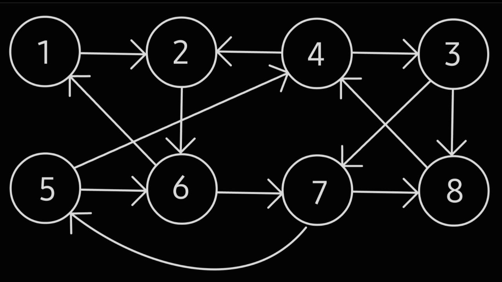

# Conjunto-Independiente

**Programa del curso de Análisis de Algoritmos**

<Autor: Jorge Daniel Velasco García>

Este programa obtiene el conjunto independiente de una gráfica dirigida dada, la cual se coloca en un archivo de texto (```.txt```). Por ejemplo:

- La gráfica dirigida que corresponde a lo escrito en el txt de la gráfica en este proyecto (```Grafica.txt```) es:



***Requisito indispensable***
- Tener instalado Python3.

Para ejecutar el programa bastará con posicionarse en:
```Conjunto-Independiente/src```

E introducir en terminal el siguiente comando a ejecutar:
```
python3 Main.py
```


Para ingresar la ruta del archivo hay dos formas distintas:

- Con la ruta absoluta: Solo pones la ruta en donde se localiza tu archivo.

- Con la ruta relativa: Para esto tienes la opción de poner el contenido de la gráfica en el archivo ```Grafica.txt``` en la carpeta ```archivo/``` de este proyecto.

    - En la terminal al ejecutar el programa, poner la ruta relativa: ```../archivo/Grafica.txt```


**IMPORTANTE:**

Para lograr ejecutar el programa, requerirás de tener instalado ```colorama``` ejecutando el siguiente comando en terminal:
```
python3 -m pip install colorama
```